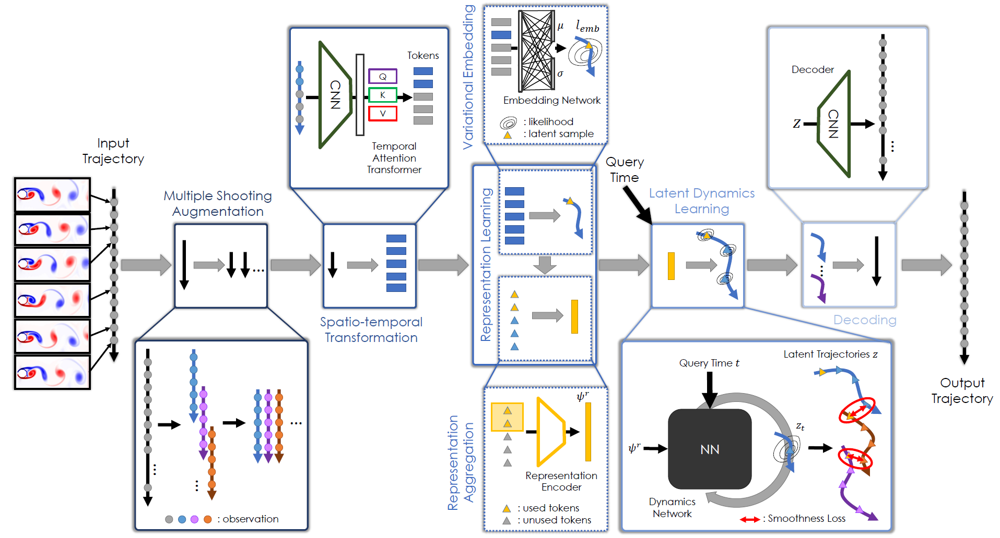

## LaDID - Invariance-based Learning of Latent Dynamics



### Overview
This is the official, preliminary PyTorch implementation of our paper [Invariance-based Learning of Latent Dynamics]().
Updates will soon after acceptance.

## Requirements
The code has been tested with PyTorch 2.0 and Cuda 11.7 on a NVIDIA A100 40Gb.
```Shell
conda create --name LaDID
conda activate LaDID
conda install pytorch=2.0.0 torchvision=0.15.0 torchaudio=2.0.0 pytorch-cuda=11.7 -c pytorch -c nvidia
pip install einops==0.6.0 matplotlib==3.6.0 argcomplete==2.0.0 h5py==3.8.0 tqdm==4.65.0
```

## Pretrained models
Checkpoints of pretrained models will follow soon in `./pretrained_ckpts`. 

## Required Data
To train and test LaDID, you will need to download the required datasets which will be released soon. 
* [Training and validation dataset]()

## Training
You can train LaDID model using `training.py`. The following command is an example for a training run a swinging pendulum dataset:
 ```Shell
CUDA_VISIBLE_DEVICES=0 LOCAL_RANK=0 WORLD_SIZE=1 RANK=0 MASTER_ADDR=127.0.0.1 MASTER_PORT=44444 python test.py --WORKERS=0 --BATCH_SIZE=16 --DATASET=single_pendulum_bw --EPOCHS=100 --lr=3e-4 --block_size=1 --increase_block_size=True --epochs_per_block_size_increase=10
```

## Evaluation
You can evaluate a pretrained LaDID model using `test.py`. The following command is an example for inference on a minimal test dataset:
 ```Shell
CUDA_VISIBLE_DEVICES=0 LOCAL_RANK=0 WORLD_SIZE=1 RANK=0 MASTER_ADDR=127.0.0.1 MASTER_PORT=44444 python test.py --WORKERS=0 --BATCH_SIZE=2
```
